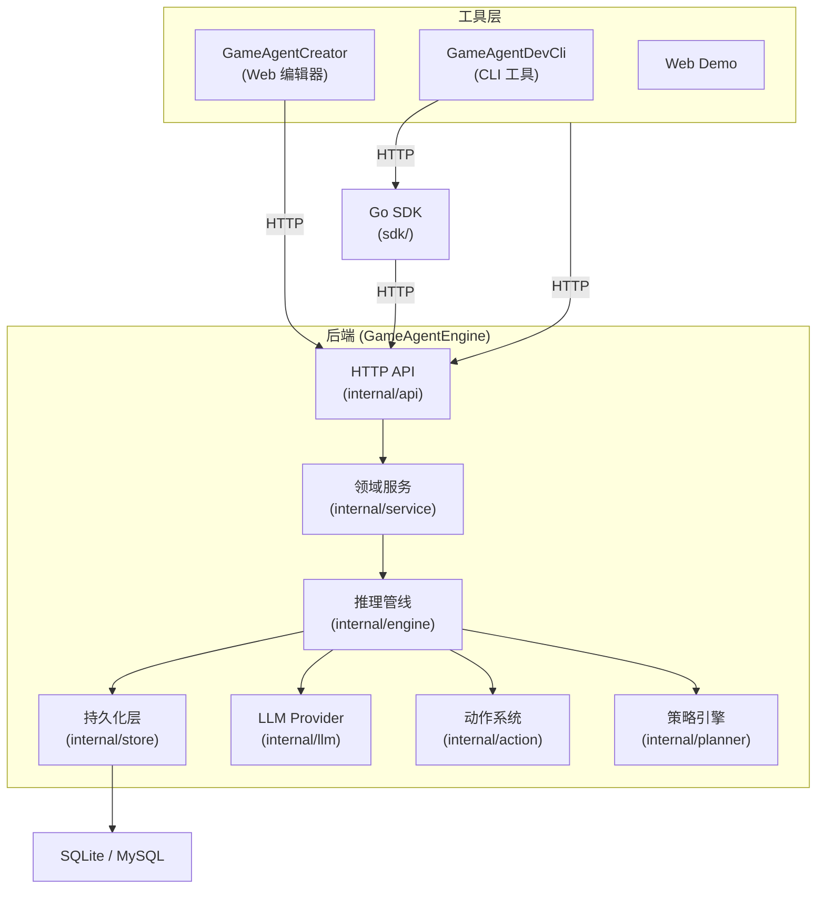
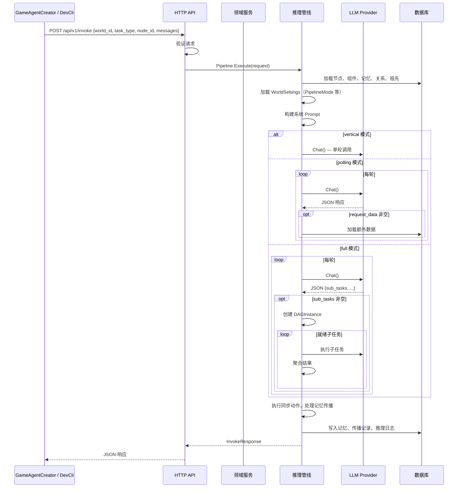
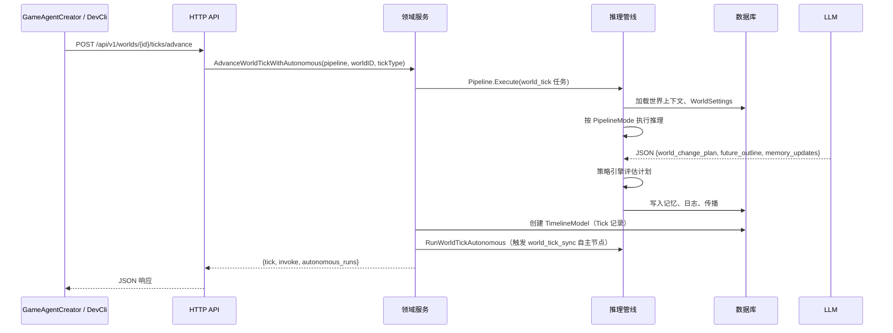

# 架构设计

**中文** | [**English**](./ARCHITECTURE_EN.md)

GameAgentEngine v0.2.0 采用分层架构，职责清晰分离。系统设计为后端服务 + HTTP API、SDK、CLI 工具、Web 可视化编辑器。

---

## 高层架构

---

## 层级说明

### 1. API 层（internal/api）

HTTP 入口。将请求路由到对应的处理函数，验证输入，将错误映射到 HTTP 状态码。

- **路由**（router.go）—— 在 http.ServeMux 上注册所有端点
- **处理器**（invoke.go, world.go, world_settings.go, policy.go 等）—— 请求解析与响应序列化
- **中间件**（middleware.go）—— API 密钥认证、CORS、幂等
- **服务错误映射**（service_error.go）—— 将 18 个领域错误码映射到 HTTP 状态

### 2. 领域服务层（internal/service）

包含业务规则和事务边界。防止 HTTP/CLI/编辑器重复验证逻辑。

- **CRUD 操作** — 节点、组件、记忆、关系的创建/更新/删除，带完整验证
- **世界导入/导出**（import_export.go）— YAML/JSON 世界配置导入，支持 dry-run
- **世界 Tick**（world.go）— 时间线刻度推进、自主节点调度、事件影响评估、局部推进
- **快照服务**（snapshot_service.go）— 快照元数据查询、校验、列表与删除
- **世界复制服务**（world_copy_service.go）— 工作副本分叉、存档快照创建与恢复流程
- **自主行为管理** — 配置、查询、手动触发自主节点行为周期

### 3. 引擎层（internal/engine）

核心推理管线。负责推理的全部生命周期：

- **三种管线模式** — vertical（单轮直通）/ polling（多轮 LLM 轮询）/ full（完整功能，含 DAG 子任务）
- **上下文构建**（context.go）— 从存储加载节点数据、组件、记忆、祖先树
- **Prompt 生成**（prompt_builders.go）— 构建任务特定的系统 Prompt
- **多轮轮询**（pipeline.go）— 支持多轮 LLM 对话，每轮可触发 request_data 数据查询
- **可观测元数据** — Response metadata、Debug traces 与 inference logs 会暴露 configured/effective pipeline mode 及轮次消耗
- **子任务 DAG**（dag.go）— LLM 声明的子任务有向无环图编排，支持重试、超时、合并模式
- **任务节点树**（tasktree.go）— 记录完整推理轨迹，用于上下文继承
- **记忆传播引擎**（propagation_engine.go）— 四种传播模式（沿父链/标签广播/定向/手动）+ 可选状态机
- **LLM 调用** — 委托给配置的 LLM Provider
- **动作执行** — 管线内执行同步动作，返回异步动作回调
- **记忆持久化与传播** — 写入记忆更新并传播到目标节点

### 4. 存储层（internal/store）

基于 GORM 的持久化。处理数据库连接、自动迁移和 CRUD 操作。

- **模型**（models.go）— 10 个数据模型：Node, Component, Memory, Relation, Timeline, InferenceLog, IdempotencyKey, WorldSnapshot, WorldPolicy, WorldSettings
- **节点操作**（nodes.go）— CRUD + 分页过滤
- **组件操作**（components.go）— 按节点获取、按类型获取、按世界获取
- **记忆操作**（memories.go）— CRUD + 层级过滤、批量创建、手动传播
- **关系操作**（relations.go）— CRUD + 分页过滤、获取节点相关关系
- **时间线与日志**（timeline.go）— 时间线刻度、推理日志
- **快照元数据**（snapshots.go）— 快照元数据创建、查询与列表
- **世界设置**（world_settings.go）— 每世界运行时设置，支持 CRUD + 默认值
- **世界策略**（policy.go）— 每世界 blocked_actions / safe_actions 策略
- **记忆传播**（propagation.go）— 传播规则、传播状态机状态

### 5. LLM Provider（internal/llm）

通过公共接口抽象 LLM API 调用：

- **OpenAI Provider**（openai.go）— 兼容任何 OpenAI 格式的 API（OpenAI, DeepSeek, Qwen 等）
- **Mock Provider**（mock.go）— 模拟 LLM 响应，用于离线开发和测试

### 6. 动作系统（internal/action）

基于注册表的动作系统，支持同步和异步两种模式：

- **同步动作** — 在管线内立即执行（add_memory, update_mood, send_dialogue）
- **异步动作** — 返回回调 ID 供游戏侧执行（adjust_relation, spawn_item）

### 7. 规划器与策略（internal/planner）

基于配置的策略评估世界变更计划：

- **PolicyEngine** — 阻止危险动作，高影响变更要求审核
- **执行模式**（ExecutionMode）— debug（详细日志）、review（高影响需确认）、production（自动执行）

---

## 数据流：NPC 对话

---

## 数据流：世界 Tick

---

## 记忆传播

引擎支持四种记忆传播模式，帮助记忆在节点层级之间流动：

| 模式 | 说明 |
|---|---|
| upward | 沿父链向上传播（默认），可通过 max_depth 限制层数 |
| tag_broadcast | 按 tags 匹配目标节点扩散 |
| targeted | 定向传播到指定节点列表 |
| manual | 不自动传播，用户手动触发 |

传播可配置为状态机模式（enable_propagation_machine），按预设规则链自动执行传播动作。

---

## 配置体系

配置分为两层：

- **静态配置**（gameagentengine.conf.yaml）：服务监听地址、数据库连接、LLM 接入信息、执行模式、自主调度器参数
- **动态配置**（数据库 WorldSettings）：管线模式、记忆限制、分析轮数、上下文深度、子任务重试/超时、传播参数

详见[配置参考](CONFIGURATION.md)。

---

---

## 世界复制边界

当前世界复制能力按用途拆成三层边界：

- ForkWorld：创建工作副本，面向分支推演、调试和并行演化。
- CreateWorldSnapshot：创建面向存档的快照世界，并保存兼容性元数据。
- RestoreWorld：在恢复前先校验快照兼容性，再生成新的可运行世界副本。

这样可以把普通分支复制与存档生命周期能力分开治理，同时继续复用底层世界图谱复制逻辑。

## 数据库 Schema

通过 GORM AutoMigrate 管理的十张表：

- **nodes** — id, world_id, name, node_type, parent_id, 时间戳
- **components** — id, node_id, component_type, data, 时间戳
- **memories** — id, node_id, content, level, tags, created_at
- **relations** — id, world_id, source_id, target_id, relation_type, weight, properties, created_at
- **timelines** — id, world_id, tick_number, tick_type, game_time, summary, data, future_outline, created_at
- **inference_logs** — id, world_id, task_type, node_id, request_data, response_data, llm_model, tokens_used, duration_ms, created_at
- **idempotency_keys** — id, result, created_at
- **world_snapshots** — source_world_id, snapshot_world_id, snapshot_name, reason, 引擎/Schema 兼容元数据, payload_hash, 时间戳
- **world_policies** — world_id, blocked_actions, safe_actions, 时间戳
- **world_settings** — world_id, memory_limit, max_analysis_rounds, max_context_depth, auto_apply, require_review_above, pipeline_mode, propagation_max_depth, sub_task_max_retries, sub_task_timeout_secs, enable_propagation_machine, 时间戳