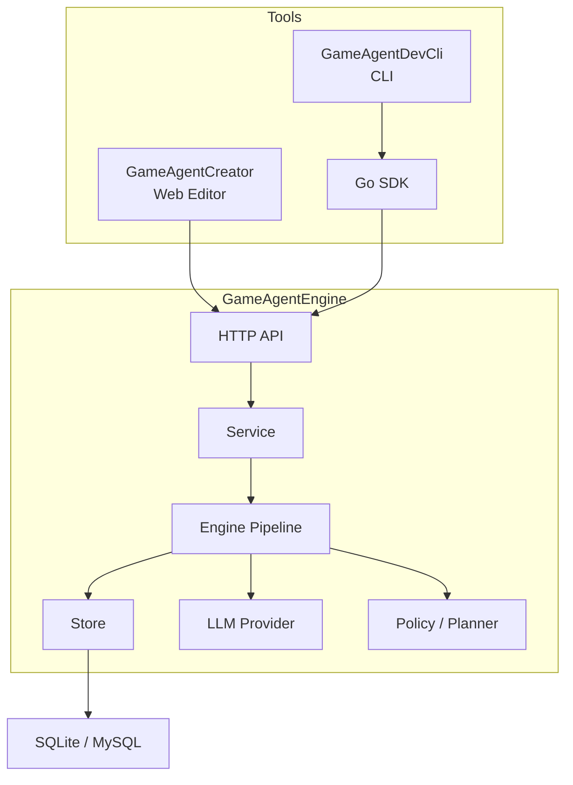

# Architecture

[**中文**](./ARCHITECTURE.md) | **English**

GameAgentEngine v0.4.6 is composed of the backend Engine, HTTP API, Go SDK, DevCli, and Creator.

---

## High-Level Structure

Creator is the only bundled frontend tool.

---

## Layer Responsibilities

### API

- routing and middleware
- request parsing and response serialization
- auth and error mapping
- endpoints for world settings, ticks, snapshots, and plan decisions

### Service

- business rules and transaction boundaries
- world import/export
- world tick and world time advancement
- world copy, save snapshot, and restore
- world settings and state component management

### Engine

- pipeline execution
- prompt construction
- multi-round polling and sub-task DAG execution
- continuity state assembly
- world time progression
- memory propagation and action execution

Key world-time relationship:

- `world_time_settings`: input rules from `world_settings`
- `world_time_state`: runtime result written into state components and timelines
