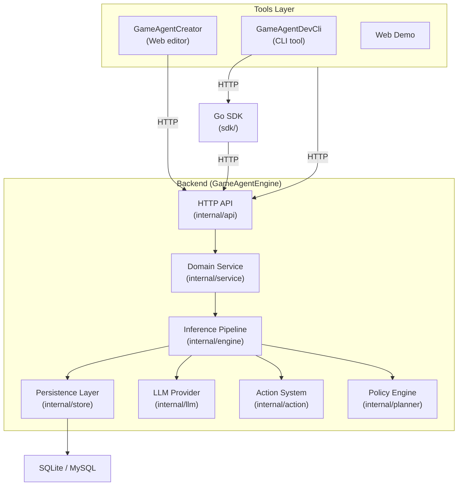
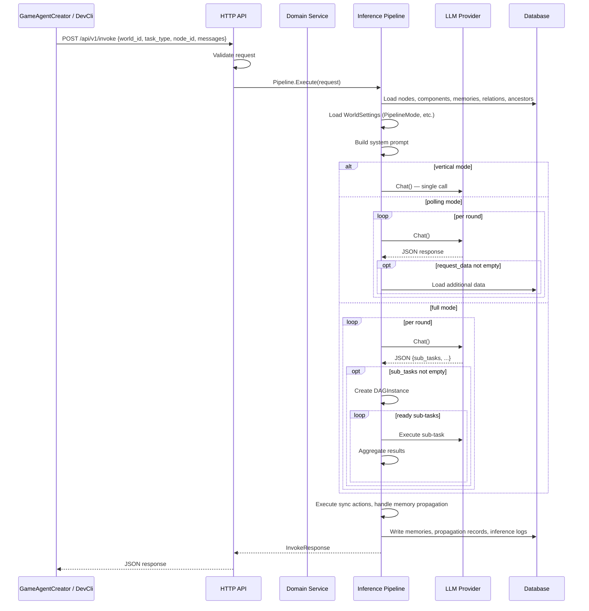
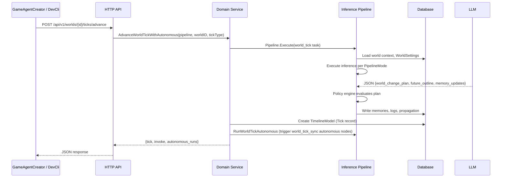

# Architecture

[**中文**](./ARCHITECTURE.md) | **English**

GameAgentEngine v0.2.0 adopts a layered architecture with clear separation of concerns. The system is designed as a backend service with an HTTP API, SDK, CLI tools, and a web-based visual editor.

---

## High-Level Architecture

---

## Layer Descriptions

### 1. API Layer (internal/api)

HTTP entry point. Routes requests to the appropriate handlers, validates input, and maps errors to HTTP status codes.

- **Router** (router.go) — registers all endpoints on `http.ServeMux`
- **Handlers** (invoke.go, world.go, world_settings.go, policy.go, etc.) — request parsing and response serialization
- **Middleware** (middleware.go) — API key authentication, CORS, idempotency
- **Service error mapping** (service_error.go) — maps 18 domain error codes to HTTP status codes

### 2. Domain Service Layer (internal/service)

Contains business rules and transaction boundaries. Prevents duplicated validation logic across HTTP/CLI/editor.

- **CRUD operations** — create/update/delete for nodes, components, memories, and relations with full validation
- **World import/export** (graph.go) — YAML/JSON world config import with dry-run support
- **World Tick** (world.go) — timeline advancement, autonomous node scheduling, event impact evaluation, scope advancement
- **World cloning** (clone.go) — duplicates a complete world with all its data, optionally locking the source world against concurrent writes
- **Autonomous behavior management** — configure, query, and manually trigger autonomous node behavior cycles

### 3. Engine Layer (internal/engine)

The core inference pipeline. Handles the entire inference lifecycle:

- **Three pipeline modes** — vertical (single-pass), polling (multi-round LLM), full (complete with DAG sub-tasks)
- **Context builder** (context.go) — loads node data, components, memories, and ancestor tree from storage
- **Prompt generation** (prompt_builders.go) — builds task-specific system prompts
- **Multi-round polling** (pipeline.go) — supports multiple LLM dialogue rounds, with request_data queries per round
- **Sub-task DAG** (dag.go) — orchestrates directed acyclic graphs of sub-tasks declared by the LLM, with retry, timeout, and merge modes
- **Task node tree** (tasktree.go) — records the complete inference trace for context inheritance
- **Memory propagation engine** (propagation_engine.go) — four propagation modes (upward/tag_broadcast/targeted/manual) with optional state machine
- **LLM invocation** — delegates to the configured LLM Provider
- **Action execution** — executes synchronous actions in-pipeline, returns async action callbacks
- **Memory persistence & propagation** — writes memory updates and propagates to target nodes

### 4. Storage Layer (internal/store)

GORM-based persistence. Handles database connection, auto-migration, and CRUD operations.

- **Models** (models.go) — 9 data models: Node, Component, Memory, Relation, Timeline, InferenceLog, IdempotencyKey, WorldPolicy, WorldSettings
- **Node operations** (nodes.go) — CRUD + paginated filtering
- **Component operations** (components.go) — get by node, by type, by world
- **Memory operations** (memories.go) — CRUD + level filtering, bulk creation, manual propagation
- **Relation operations** (relations.go) — CRUD + paginated filtering, get node-related relations
- **Timeline & logs** (timeline.go) — timeline ticks, inference logs
- **World settings** (world_settings.go) — per-world runtime settings with CRUD + defaults
- **World policy** (policy.go) — per-world blocked_actions / safe_actions policy
- **Memory propagation** (propagation.go) — propagation rules, propagation state machine state

### 5. LLM Provider (internal/llm)

Abstracts LLM API calls through a common interface:

- **OpenAI Provider** (openai.go) — compatible with any OpenAI-format API (OpenAI, DeepSeek, Qwen, etc.)
- **Mock Provider** (mock.go) — simulates LLM responses for offline development and testing

### 6. Action System (internal/action)

A registry-based action system supporting both synchronous and asynchronous modes:

- **Sync actions** — executed immediately within the pipeline (add_memory, update_mood, send_dialogue)
- **Async actions** — return a callback ID for the game side to execute (adjust_relation, spawn_item)

### 7. Planner & Policy (internal/planner)

Evaluates world change plans against configured policy:

- **PolicyEngine** — blocks dangerous actions, requires review for high-impact changes
- **ExecutionMode** — debug (verbose logging), review (high-impact requires confirmation), production (auto-apply)

---

## Data Flow: NPC Dialogue

---

## Data Flow: World Tick

---

## Memory Propagation

The engine supports four memory propagation modes to help memories flow between node levels:

| Mode | Description |
|---|---|
| upward | Propagate up the parent chain (default); depth limited by max_depth |
| tag_broadcast | Spread to nodes matching given tags |
| targeted | Direct propagation to a specified list of nodes |
| manual | No automatic propagation; user triggers manually |

Propagation can be configured as a state machine (enable_propagation_machine), which automatically executes propagation actions according to preset rule chains.

---

## Configuration System

Configuration is divided into two layers:

- **Static config** (gameagentengine.conf.yaml): server address, database connection, LLM access info, execution mode, autonomous scheduler parameters
- **Dynamic config** (database WorldSettings): pipeline mode, memory limit, analysis rounds, context depth, sub-task retry/timeout, propagation parameters

See [Configuration Reference](CONFIGURATION_EN.md).

---

## Database Schema

Nine tables managed by GORM AutoMigrate:

- **nodes** — id, world_id, name, node_type, parent_id, timestamps
- **components** — id, node_id, component_type, data, timestamps
- **memories** — id, node_id, content, level, tags, created_at
- **relations** — id, world_id, source_id, target_id, relation_type, weight, properties, created_at
- **timelines** — id, world_id, tick_number, tick_type, game_time, summary, data, future_outline, created_at
- **inference_logs** — id, world_id, task_type, node_id, request_data, response_data, llm_model, tokens_used, duration_ms, created_at
- **idempotency_keys** — id, result, created_at
- **world_policies** — world_id, blocked_actions, safe_actions, timestamps
- **world_settings** — world_id, memory_limit, max_analysis_rounds, max_context_depth, auto_apply, require_review_above, pipeline_mode, propagation_max_depth, sub_task_max_retries, sub_task_timeout_secs, enable_propagation_machine, timestamps