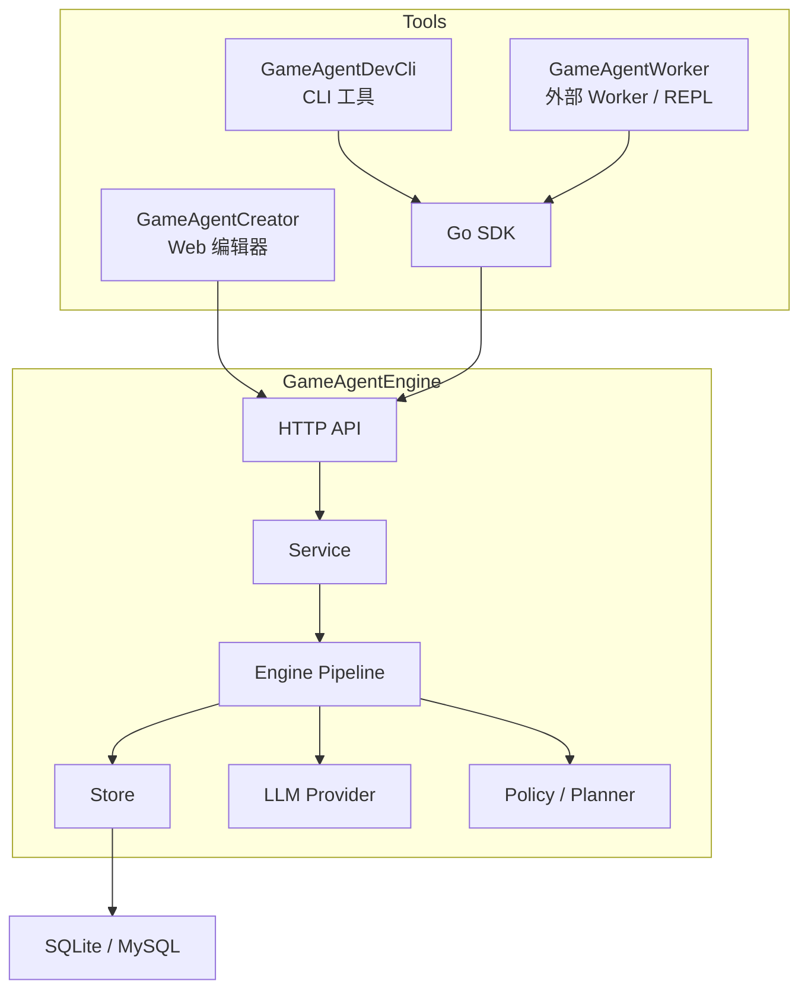

# 架构设计

**中文** | [**English**](./ARCHITECTURE_EN.md)

GameAgentEngine v0.5.0 由后端 Engine、HTTP API、Go SDK、DevCli、Worker 和 Creator 组成。

---

## 高层结构

当前可视化前端工具仍只有 Creator，但本地开发与集成测试工具链已经同时包含 Worker。

---

## 分层职责

### API

- 路由与中间件
- 请求解析和响应序列化
- 鉴权与错误映射
- 世界设置、Tick、快照、计划审批等接口

### Service

- 业务规则与事务边界
- 世界导入导出
- 世界 Tick 与世界时间推进
- 世界复制、存档快照、恢复
- 世界设置与状态组件管理

### Engine

- 推理管线执行
- Prompt 组装
- 多轮轮询与子任务 DAG
- 连续性状态组装
- 世界时间系统推进
- 记忆传播与动作执行

世界时间相关的关键关系：

- `world_time_settings`：输入规则，来自 `world_settings`
- `world_time_state`：运行结果，写入状态组件和时间线

### Store

- GORM 持久化
- 节点、组件、记忆、关系 CRUD
- 时间线、日志、快照元数据
- `world_settings`、`world_policy`、传播状态持久化

### SDK / DevCli / Worker / Creator

- SDK：HTTP API 的 Go 封装
- DevCli：命令行建模、推进、调试与运维入口
- Worker：游戏侧异步接口模拟、pull consumer、callback 闭环、play REPL 与内置集成测试入口
- Creator：可视化建模、配置、推进与排查入口
