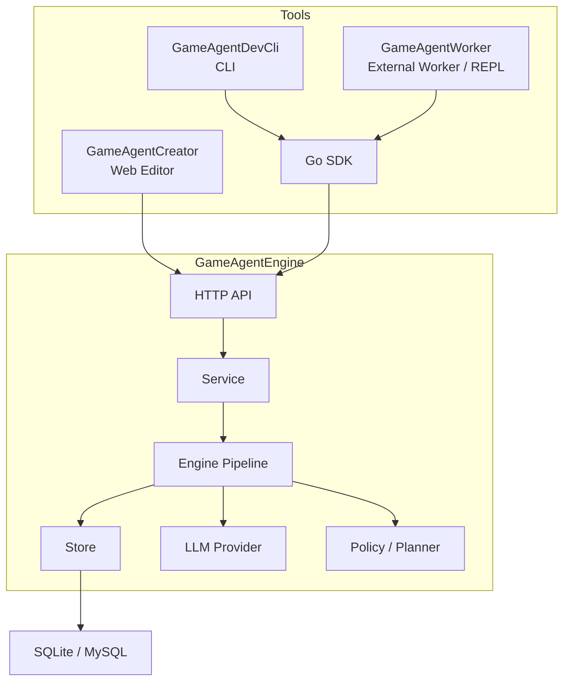

# Architecture

[**中文**](./ARCHITECTURE.md) | **English**

GameAgentEngine v0.5.0 is composed of the backend Engine, HTTP API, Go SDK, DevCli, Worker, and Creator.

---

## High-Level Structure

Creator is still the only bundled visual frontend, but the local development and integration-testing toolchain now also includes Worker as a first-class executable.

---

## Layer Responsibilities

### API

- routing and middleware
- request parsing and response serialization
- auth and error mapping
- endpoints for world settings, ticks, snapshots, and plan decisions

### Service

- business rules and transaction boundaries
- world import/export
- world tick and world time advancement
- world copy, save snapshot, and restore
- world settings and state component management

### Engine

- pipeline execution
- prompt construction
- multi-round polling and sub-task DAG execution
- continuity state assembly
- world time progression
- memory propagation and action execution

Key world-time relationship:

- `world_time_settings`: input rules from `world_settings`
- `world_time_state`: runtime result written into state components and timelines

### Store

- GORM-based persistence
- node / component / memory / relation CRUD
- timelines, logs, and snapshot metadata
- persistence for `world_settings`, `world_policy`, and propagation state

### SDK / DevCli / Worker / Creator

- SDK: Go wrapper around the HTTP API
- DevCli: command-line entrypoint for modeling, ticking, debugging, and operations
- Worker: game-side async interface simulation, pull consumer loop, callback closure, play REPL, and packaged integration scenarios
- Creator: visual entrypoint for modeling, configuration, ticking, and diagnostics
